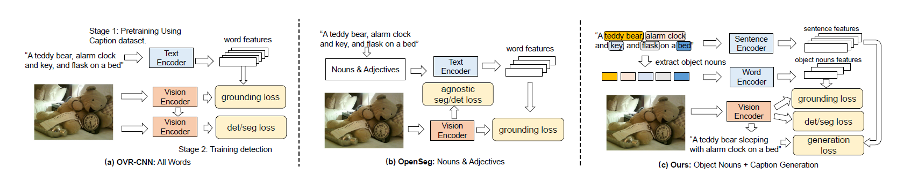
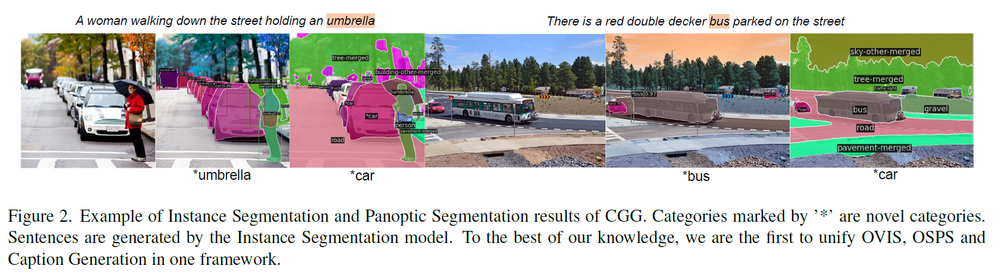

# Betrayed-by-Captions: Joint Caption Grounding and Generation for Open Vocabulary Instance Segmentation
Jianzong Wu, [Xiangtai Li](https://lxtgh.github.io/), [Henghui Ding](https://henghuiding.github.io/), [Xia Li](https://xialipku.github.io/), [Guangliang Cheng](https://scholar.google.com.hk/citations?user=FToOC-wAAAAJ&hl=zh-CN), [Yunhai Tong](https://scholar.google.com.hk/citations?user=T4gqdPkAAAAJ&hl=zh-CN), [Chen Change Loy](https://www.mmlab-ntu.com/person/ccloy/)

## Short Introduction
In this work, we focus on instance-level open vocabulary segmentation, intending to expand a segmenter for instance-wise novel categories without mask annotations.
We investigate a simple yet effective framework with the help of image captions, focusing on exploiting thousands of object nouns in captions to discover instances of novel classes. Rather than adopting pretrained caption models or using massive caption datasets with complex pipelines, we propose an end-to-end solution from two aspects: caption grounding and caption generation.
In particular, we devise a joint Caption Grounding and Generation (CGG) framework based on a Mask Transformer baseline. The framework has a novel grounding loss that performs explicit and implicit multi-modal feature alignments.
Moreover, we design a lightweight caption generation head to allow for additional caption supervision. We find that grounding and generation complement each other, significantly enhancing the segmentation performance for novel categories. 
We conduct extensive experiments on the COCO dataset with two settings: Open Vocabulary Instance Segmentation (OVIS) and Open Set Panoptic Segmentation (OSPS). The results demonstrate the superiority of our CGG framework over previous OVIS methods, achieving a large improvement of 6.8% mAP on novel classes without extra caption data. Our method also achieves over 15% PQ improvements for novel classes on the OSPS benchmark under various settings.

## Results

